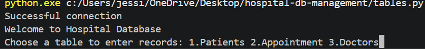
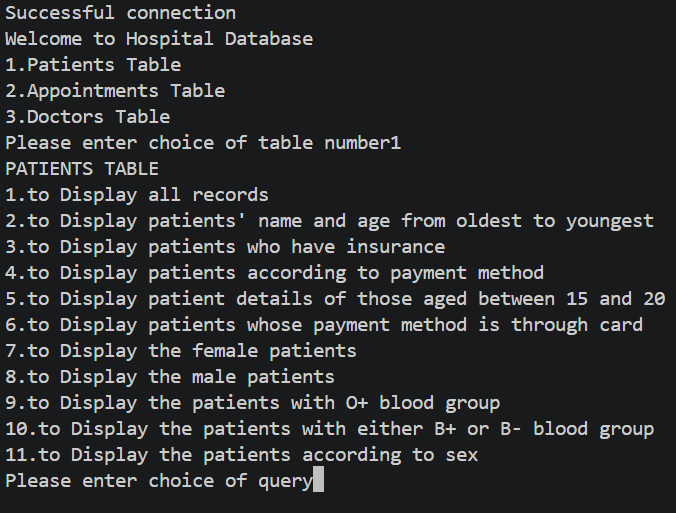
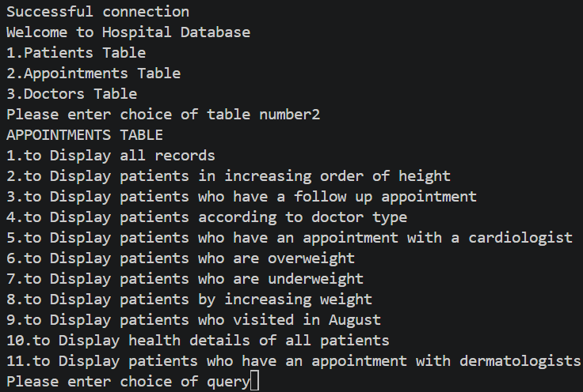
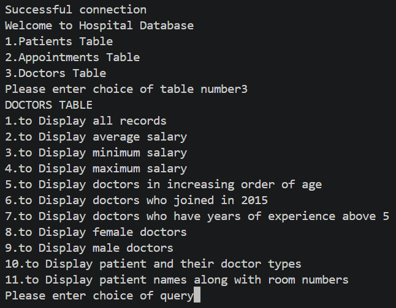

# Hospital Database Management System

A terminal-based database management system built with Python and MySQL 
that allows users to manage hospital records across three core modules:
doctors, patients, and appointments.

## Features

- Add unlimited records across all three modules
- Interactive query menu: choose from a set of predefined queries 
  to retrieve and display hospital data
- Clean terminal interface with guided user input
- Structured relational database design across 3 tables

## Tech Stack

- Language: Python
- Database: MySQL
- Interface: Command Line (Terminal)

## Database Structure

| Table        | Description                                       |
|--------------|---------------------------------------------------|
| Doctors      | Stores doctor records and details                 |
| Patients     | Stores patient records and details                |
| Appointments | Manages appointments between doctors and patients |

## How to Run

1. Make sure you have Python and MySQL installed on your machine
2. Clone this repository
   git clone https://github.com/YOUR_USERNAME/hospital-db-management.git
3. Set up your MySQL database and update the connection details in the code
4. Run the program
   python main.py
5. Follow the on-screen menu to add records or run queries

## Screenshots

## About

Originally built as a school team project, later independently expanded 
and restructured. Led the original team of 3 members through design, 
development, and testing.

## Author

**Jessica Mariana John**
[LinkedIn](https://linkedin.com/in/jessicajohn23)
